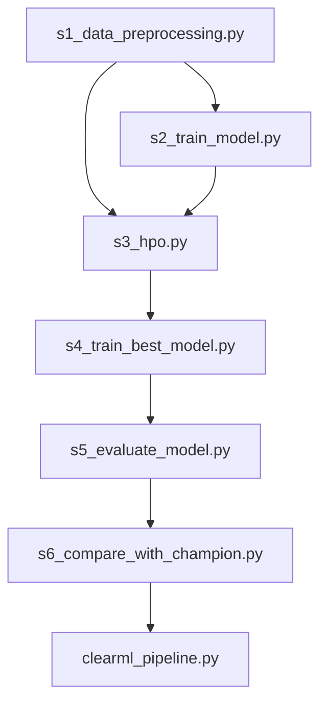

# Nutrition Analyser - Data & Training Pipeline

This directory contains the automated machine learning pipeline for food nutrition estimation from images. It uses **ClearML** for task tracking, dataset versioning, hyperparameter optimization, and pipeline orchestration.

---

## Pipeline Architecture

The workflow consists of 6 sequential steps orchestrated by a `PipelineController`:



### Step Descriptions

1. **`s1_data_preprocessing.py`**: Loads raw food nutrition images/metadata, splits them into train and test sets, and registers them as a ClearML Dataset.
2. **`s2_train_model.py`**: Trains the baseline ResNet18 model to predict four nutrition targets: **Calories**, **Protein**, **Carbohydrates**, and **Fat**.
3. **`s3_hpo.py`**: Performs Hyperparameter Optimization (HPO) using Optuna to find the best learning rate, batch size, and weight decay.
4. **`s4_train_best_model.py`**: Trains the chosen CNN architecture using the optimized hyperparameters from the HPO step for 100 epochs.
5. **`s5_evaluate_model.py`**: Evaluates the newly trained best model on the test dataset, logging MAE, RMSE, and MSE.
6. **`s6_compare_with_champion.py`**: Compares the metrics of the new model against the current registered champion model. If the new model performs better, it becomes the new champion.

---

## Utility Modules

- **`data_module.py`**: Contains data downloading utilities, transforms, PyTorch custom datasets, and PyTorch dataloaders.
- **`model_module.py`**: Contains PyTorch model architecture definitions (supporting ResNet18, ResNet34, and MobileNetV3 Small) and training loop logic.

---

## Setup & Running

### 1. Prerequisites
Ensure you have installed the required packages:
```bash
pip install -r requirements.txt
```
Make sure your ClearML credentials are set up locally in your shell or `clearml.conf`.

### 2. First-time Registration (Manual Run)
The first time you set up the project, you must register the tasks in ClearML by running them manually:
```bash
python s1_data_preprocessing.py
python s2_train_model.py
python s3_hpo.py
python s4_train_best_model.py
python s5_evaluate_model.py
python s6_compare_with_champion.py
```

### 3. Start ClearML Agents
To process tasks in the queues, start two local workers in separate terminal tabs:
* **Worker 1 (Training Queue)**:
  ```bash
  CLEARML_WORKER_ID=hpo-trainer clearml-agent daemon --queue default
  ```
* **Worker 2 (HPO Controller Queue)**:
  ```bash
  CLEARML_WORKER_ID=hpo-controller clearml-agent daemon --queue hpo_service
  ```

### 4. Running the Full Pipeline
Once tasks are registered, trigger the end-to-end orchestrated pipeline using:
```bash
python clearml_pipeline.py
```
